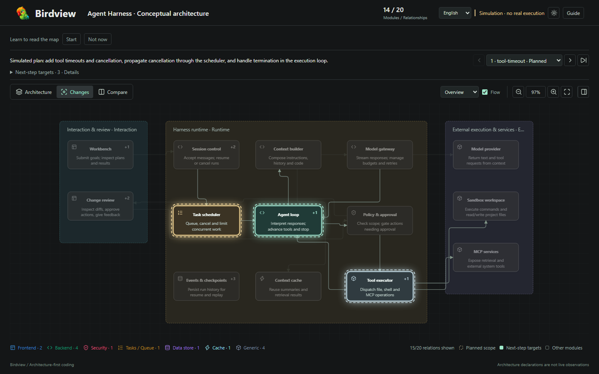

<div align="center">
  
  <h1>Birdview</h1>
  <p><strong>Transform your development workflow with Birdview! Shift your focus from code to architecture—and break open the black box of AI coding!</strong></p>
  <p><strong>See AI changes before they happen.</strong></p>
  <p>
    
    
    
    
    
  </p>
</div>

<p align="center">
  <a href="#quick-start">Quick Start</a> ·
  <a href="#how-it-works">How It Works</a> ·
  <a href="examples/harness-activity.html">Live Demo</a> ·
  <a href="https://qiuner.github.io/birdview/">Project Site</a> ·
  <a href="README.zh.md">简体中文</a>
</p>

<!-- [简体中文](README.zh.md) -->

Birdview is a skill for AI coding agents. Before editing code, it asks the agent to map the project, state which modules and files the task will affect, and only then begin implementation. The result is a standalone, interactive HTML page that opens directly in a browser and requires no deployed service.

**[Project site](https://qiuner.github.io/birdview/):** [qiuner.github.io/birdview](https://qiuner.github.io/birdview/) · **[Topics](https://github.com/Qiuner/birdview#readme):** `agent-tools` `architecture-as-code` `code-visualization` `coding-agents` `developer-tools` `software-architecture`

For example, suppose you ask AI to "add rate limiting to the login endpoint":

- Normal flow: the AI searches and edits immediately, leaving you to inspect the final diff for missed or unrelated changes.
- Birdview flow: the AI first shows which modules handle login, which files it plans to edit, and which source evidence supports that plan. It then implements against that map and records the checks it actually ran.

Birdview does not automatically observe every agent action, and it does not replace Git diffs, tests, or code review. It puts the agent's understanding of the system and its declared change scope on one architecture map, so scope mistakes can be caught before the implementation is finished.

<p align="center">
  
</p>

> The screenshot uses the fictional agent harness included in this repository. It does not represent observed production activity.

## What Birdview Shows

Logs tell you which actions the AI took, and diffs tell you which lines changed. Neither directly answers: where does this change sit in the system, what else can it affect, and why did the AI decide these files belong to the task?

Birdview puts those answers on one page:

- **System map:** the modules in the project, what each owns, and how they connect.
- **Current change:** the modules and files the agent says it will touch, plus its current step.
- **Source evidence:** the files or code locations behind each architectural claim.
- **Comparison:** the full architecture and current change scope on the same layout.
- **Verification:** the checks the agent actually ran and whether they passed.

Everything is packaged into one HTML file with light and dark themes, relationship filters, module details, and Chinese and English controls. The architecture data and activity records are checked for structure and consistency before the page is generated.

## Quick Start

**Did Birdview map your project correctly?** [Share your experience](https://github.com/Qiuner/birdview/issues/new?template=usage_feedback.yml)—successful runs, missing modules, incorrect relationships and installation problems are all welcome. No diagnosis or private source code is needed; screenshots and sanitized examples are optional.

Install it with the third-party `skills` CLI:

```sh
npx skills add Qiuner/birdview --skill birdview
```

Then start a new agent task, for example:

> Use Birdview to show this project's architecture; do not edit code.

Confirm that the agent creates `.birdview/architecture.json` and an HTML architecture map that opens in a browser. See the [installation guide](docs/installation.md) for complete Codex, Claude Code, and DeepSeek Harness setup and verification steps. See the [0.2.1 release notes](docs/release-notes-0.2.1.md) for this release's features and limitations.

### Run the Demo from Source

Developing Birdview or running the bundled demo requires Node.js 18 or newer:

```sh
npm ci
npm run validate:examples
npm test
npm run build:demo
```

Open [`examples/harness-activity.html`](examples/harness-activity.html) in a browser. The project and agent activity shown in the demo are simulated.

## Viewer Guide

After opening the generated HTML, switch between **Architecture**, **Changes**, and **Side by Side**. Select a module to inspect its responsibility, owned files, and source evidence. The activity history shows the plan, progress, and checks declared by the agent.

On the first visit, follow **Guide** for a short walkthrough, or skip it and press Escape at any time. You can reopen it later from the toolbar.

## Activation Modes

Birdview has two activation modes:

- **Auto (default):** before every code change, the agent checks the map and declares the affected modules.
- **On demand:** Birdview runs only when you explicitly request it or ask to see the map before editing.

Tell the agent to "enable Birdview auto mode for this project" or "switch to on-demand", or run:

```sh
node <skill-root>/scripts/birdview.mjs mode auto --project <project-root>
node <skill-root>/scripts/birdview.mjs mode on-demand --project <project-root>
node <skill-root>/scripts/birdview.mjs mode --project <project-root>
```

These commands only add a small Birdview configuration block to the project's agent instruction file; they do not intercept filesystem writes. Codex and DeepSeek Harness use `AGENTS.md` by default. Add `--agent claude-code` to use `CLAUDE.md`. Saying "use Birdview this time" does not permanently change the mode. See [modes and CLI setup](references/modes.md).

## Generate the HTML Directly

The agent normally handles these steps. If you already have an architecture file in the expected format, you can validate it and generate the HTML yourself:

```sh
node scripts/validate.mjs .birdview/architecture.json
node scripts/render.mjs .birdview/architecture.json .birdview/architecture.html
```

To also show the task activity declared by the agent, add an activity history:

```sh
node scripts/validate.mjs .birdview/architecture.json .birdview/activity.jsonl
node scripts/render.mjs .birdview/architecture.json .birdview/activity.html .birdview/activity.jsonl
```

Add `--bilingual` when both Chinese and English content must be validated. Use `--simulation` only to mark fictional demo activity.

## How It Works

```text
project source ──> architecture.json ─┐
                                     ├──> validate ──> render ──> standalone HTML
agent declarations ─> activity.jsonl ┘
```

`architecture.json` describes project modules, responsibilities, file ownership, source evidence, and relationships. The optional `activity.jsonl` records the task scope, current target, progress, and verification results declared by the agent, one event per line. The renderer checks that the two inputs agree before generating the HTML.

The workflow has two stages:

1. **Understand the project:** the agent reads the source, creates or updates the architecture map, and links modules to source evidence.
2. **Carry out a task:** on the same map, the agent marks its planned change scope, current progress, and real check results.

See [Stage 1: Map a project](references/map-project.md) and [Stage 2: Show changes](references/show-changes.md) for the complete workflow.

## Data Contracts

| Input | Purpose |
| --- | --- |
| `architecture.json` | Project identity, modules, ownership, evidence, relationships, groups, and stable layout |
| `activity.jsonl` | Ordered, agent-declared task scope, targets, files, phases, and verification records |
| `architecture.html` | Generated standalone viewer containing the validated map and optional activity history |

The schemas enforce structure. [`scripts/validate.mjs`](scripts/validate.mjs) also checks cross-record rules such as stable map identity, contiguous sequences, valid scope and targets, file ownership, and consistent check results. Validation does not prove that architecture claims are true or that referenced source files exist.

## Project Layout

| Path | Contents |
| --- | --- |
| [`schemas/`](schemas) | Architecture and activity JSON Schemas |
| [`scripts/`](scripts) | Validator, standalone renderer, and documentation checks |
| [`assets/`](assets) | Shared viewer template, styling, routing, activity, and localization code |
| [`examples/`](examples) | Fictional maps, activity records, and the generated interactive demo |
| [`references/`](references) | Authoring workflow, contract, activity, and bilingual guidance |
| [`test/`](test) | Contract, rendering, and optional browser-level checks |

## Current Boundaries

Birdview v0.1 is deliberately file-based:

- Activity is declared by an agent; Birdview does not automatically observe coding operations.
- Updates require regenerating the HTML and refreshing the browser.
- Live transport, automatic refresh, and rendered-display acknowledgements are not implemented.
- A `completed` event does not prove checks passed; only recorded check results make that claim.
- The package is currently marked private and is not published to npm.

## Development

```sh
npm test                 # Contract and renderer tests
npm run validate:examples
npm run build:demo       # Rebuild the fictional activity demo
node scripts/check-docs.mjs
```

Browser-level checks live in [`test/viewer.browser.mjs`](test/viewer.browser.mjs) and require a local Playwright installation or `BIRDVIEW_PLAYWRIGHT_PATH` pointing to one.

For the field semantics and invariants, read the [Birdview contract](references/contract.md). Documentation changes must follow the bilingual rules in [CONTRIBUTING.md](CONTRIBUTING.md).

## License

Released under the [MIT License](LICENSE). Copyright (c) 2026 Qiuner.
Third-party notices are preserved in [THIRD_PARTY_NOTICES](THIRD_PARTY_NOTICES).

For release preparation, see the [release checklist](docs/releasing.md).
