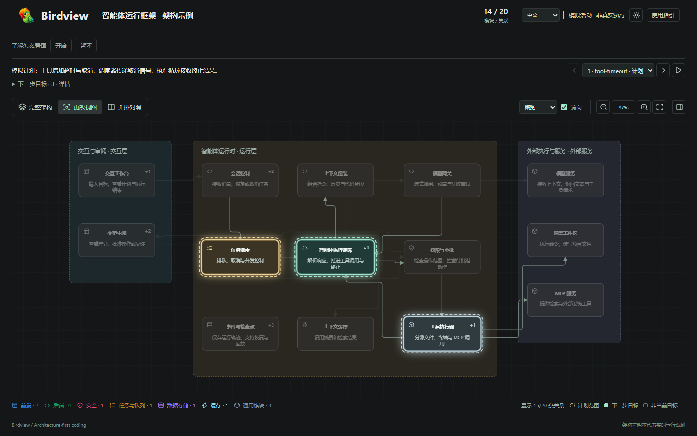

<div align="center">
  
  <h1>Birdview</h1>
  <p><strong>以架构为先，让 Agent 声明的代码变更清晰可见。</strong></p>
  <p>
    
    
    
    
    
  </p>
</div>

<p align="center">
  <a href="#快速开始">快速开始</a> ·
  <a href="#工作原理">工作原理</a> ·
  <a href="examples/harness-activity.html">交互演示</a> ·
  <a href="https://qiuner.github.io/birdview/">项目介绍页</a> ·
  <a href="README.md">English</a>
</p>

<!-- [English](README.md) -->

Birdview 将有证据支撑的架构描述和 Agent 声明的活动记录，生成独立、可交互的 HTML 视图。系统结构、文件归属、变更范围与验证结果会落在同一张稳定地图上，让审阅者看清工作发生在哪里，以及为什么发生。

**项目介绍页：** [qiuner.github.io/birdview](https://qiuner.github.io/birdview/) · **主题：** `agent-tools` `architecture-as-code` `code-visualization` `coding-agents` `developer-tools` `software-architecture`

<p align="center">
  
</p>

> 截图使用仓库内置的虚构智能体运行框架，不代表观测到的生产活动。

## 为什么需要 Birdview

AI 编码日志解释事情怎样随时间发生，diff 解释哪些代码行发生变化。Birdview 补上缺少的系统上下文：涉及哪些架构职责、地图由什么证据支持、哪些模块属于任务范围，以及实际完成了哪些验证。

Birdview v0.1 提供：

- 带稳定模块 ID、明确文件归属和源码证据的架构地图。
- 在同一布局上的完整架构、更改和并排对照视图。
- 针对地图与活动历史的 JSON Schema 和语义校验。
- 无需服务器或网络资源的自包含 HTML 输出。
- 响应式明暗主题、关系筛选和模块详情查看。
- 中英文界面控件，并支持用其他语言编写内容。

## 快速开始

在 Agent 中使用 Birdview 请参考[安装指南](docs/installation.zh.md)。首版功能与限制见 [0.1.0 发布说明](docs/release-notes-0.1.0.zh.md)。

从源码检出运行演示：

Birdview 需要 Node.js 18 或更高版本。

```sh
npm ci
npm run validate:examples
npm test
npm run build:demo
```

在浏览器中打开 [`examples/harness-activity.html`](examples/harness-activity.html)。该演示由 [`examples/system.architecture.json`](examples/system.architecture.json) 和 [`examples/harness.activity.jsonl`](examples/harness.activity.jsonl) 生成，所有活动均为模拟数据。

## 查看器指引

点击工具栏的**使用指引**，逐步了解完整架构、本次修改、并排对照、模块证据和活动历史。没有活动数据时只展示架构与证据两步。首次访问的邀请可忽略；随时关闭、跳过或按 Escape 退出，恢复原来的视图、记录、选择与缩放。文案跟随所选中英文界面语言，浏览器存储可用时记住关闭状态，工具栏始终可重新打开指引。

## 触发模式

Birdview 默认**自动介入**：每次改代码先检查并复用/更新架构图、渲染并声明涉及模块，再开始编辑；也覆盖明确分析涉及模块的规划。项目显式设置的**按需模式**仍然保留，需要明确要求 Birdview 或改前看图才介入。可以说“这个项目开启 Birdview 自动模式”或“切换为按需模式”，也可执行：

```sh
node <skill-root>/scripts/birdview.mjs mode auto --project <project-root>
node <skill-root>/scripts/birdview.mjs mode on-demand --project <project-root>
node <skill-root>/scripts/birdview.mjs mode --project <project-root>
```

命令只管理项目 `AGENTS.md` 中自己的段落。“这次用 Birdview”不持久化设置。这是 Agent 指令，不是写入拦截。详见[模式与 CLI 配置](references/modes.zh.md)。

## 渲染你的项目

按照 [`schemas/architecture.schema.json`](schemas/architecture.schema.json) 创建架构文件，然后校验并渲染：

```sh
node scripts/validate.mjs .birdview/architecture.json
node scripts/render.mjs .birdview/architecture.json .birdview/architecture.html
```

需要加入声明式活动历史时：

```sh
node scripts/validate.mjs .birdview/architecture.json .birdview/activity.jsonl
node scripts/render.mjs .birdview/architecture.json .birdview/activity.html .birdview/activity.jsonl
```

需要中英文完整内容时，为校验器添加 `--bilingual`。`--simulation` 只能用于虚构活动记录。

## 工作原理

```text
项目源码 ──────> architecture.json ─┐
                                    ├──> 校验 ──> 渲染 ──> 独立 HTML
Agent 声明 ─────> activity.jsonl ────┘
```

架构文件定义模块、职责、归属、证据、关系与布局。可选的 JSONL 事件流将有序任务事件绑定到特定项目、地图修订版本和一组模块 ID。渲染器会先校验两个输入，再生成视图。

推荐工作流包含两个有先后顺序的阶段：

1. 检查项目，建立或更新有证据支撑的架构地图，完成校验并审阅生成的 HTML。
2. 面对具体编码任务，在同一地图版本上声明计划范围、当前目标、文件、生命周期阶段和真实检查结果。

完整流程见[阶段 1：建立项目地图](references/map-project.zh.md)和[阶段 2：表达变更](references/show-changes.zh.md)。

## 数据契约

| 输入 | 用途 |
| --- | --- |
| `architecture.json` | 项目标识、模块、归属、证据、关系、分组和稳定布局 |
| `activity.jsonl` | 有序的 Agent 声明，包括任务范围、目标、文件、阶段和验证记录 |
| `architecture.html` | 包含已校验地图与可选活动历史的独立查看器 |

Schema 负责约束结构。[`scripts/validate.mjs`](scripts/validate.mjs) 还会检查稳定地图标识、连续序号、合法范围与目标、文件归属以及一致的检查结果等跨记录规则。校验不会证明架构声明真实，也不会证明引用的源码文件存在。

## 项目结构

| 路径 | 内容 |
| --- | --- |
| [`schemas/`](schemas) | 架构与活动 JSON Schema |
| [`scripts/`](scripts) | 校验器、独立页面渲染器和文档检查 |
| [`assets/`](assets) | 共享查看器模板、样式、连线路由、活动与本地化代码 |
| [`examples/`](examples) | 虚构地图、活动记录和生成后的交互演示 |
| [`references/`](references) | 编写流程、契约、活动与双语指引 |
| [`test/`](test) | 契约、渲染和可选的浏览器级检查 |

## 当前边界

Birdview v0.1 有意采用文件快照模式：

- 活动由 Agent 声明，Birdview 不会自动观测编码操作。
- 更新后需要重新生成 HTML 并刷新浏览器。
- 尚未实现实时传输、自动刷新和显示确认回执。
- `completed` 事件不能证明检查通过，只有明确记录的检查结果才能表达这一结论。
- 当前包标记为私有，尚未发布到 npm。

## 开发

```sh
npm test                 # 契约与渲染器测试
npm run validate:examples
npm run build:demo       # 重新生成虚构活动演示
node scripts/check-docs.mjs
```

浏览器级检查位于 [`test/viewer.browser.mjs`](test/viewer.browser.mjs)，需要本地安装 Playwright，或通过 `BIRDVIEW_PLAYWRIGHT_PATH` 指向相应模块。

字段语义和约束见 [Birdview 契约](references/contract.zh.md)。文档修改必须遵循 [CONTRIBUTING.zh.md](CONTRIBUTING.zh.md) 中的双语规则。

## 许可证

采用 [MIT 许可证](LICENSE)。Copyright (c) 2026 Qiuner。
第三方许可证声明保留在 [THIRD_PARTY_NOTICES](THIRD_PARTY_NOTICES) 中。

发版准备见[发布检查清单](docs/releasing.zh.md)。
